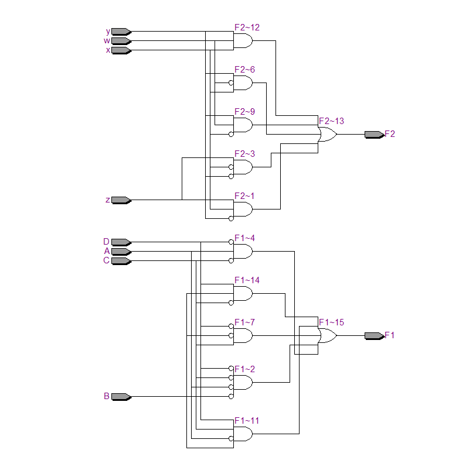
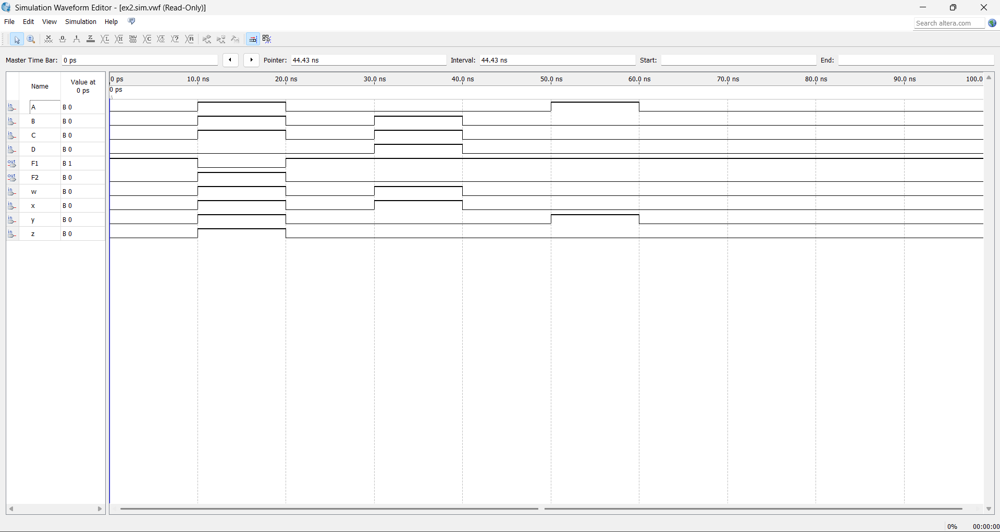

# BOOLEAN_FUNCTION_MINIMIZATION

**AIM:**

To implement the given logic function verify its operation in Quartus using Verilog programming.

F1= A’B’C’D’+AC’D’+B’CD’+A’BCD+BC’D 

F2=xy’z+x’y’z+w’xy+wx’y+wxy

**Equipment Required:**

Hardware – PCs, Cyclone II , USB flasher

**Software – Quartus prime**

**Theory**

**Logic Diagram**

**Procedure**

1.	Type the program in Quartus software.

2.	Compile and run the program.

3.	Generate the RTL schematic and save the logic diagram.

4.	Create nodes for inputs and outputs to generate the timing diagram.

5.	For different input combinations generate the timing diagram.


**Program:**

```
module ex2 (
    input A, B, C, D,
    input w, x, y, z,
    output F1, F2
);

// F1 Implementation
assign F1 = (~A & ~B & ~C & ~D) |
            (A & ~C & ~D) |
            (~B & C & ~D) |
            (~A & B & C & D) |
            (B & ~C & D);

// F2 Implementation
assign F2 = (x & ~y & z) |
            (~x & ~y & z) |
            (~w & x & y) |
            (w & ~x & y) |
            (w & x & y);

endmodule
```

Developed by: SHUBNUM FATHIMA AB
RegisterNumber:212225240147


**RTL realization**

**Output:**

**Result:**
Thus the given logic functions are implemented using and their operations are verified using Verilog programming.

